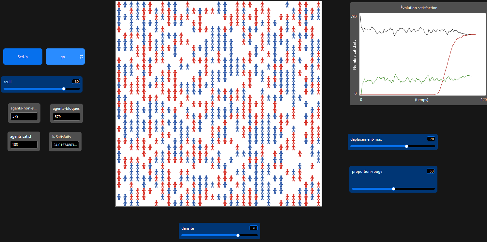
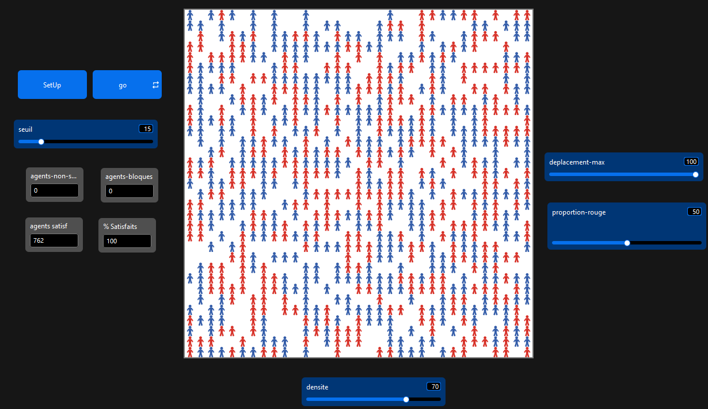
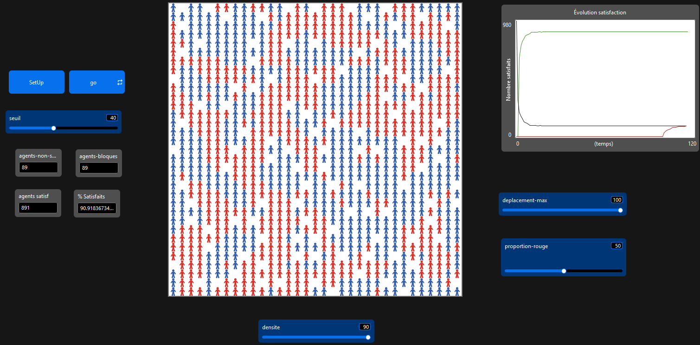
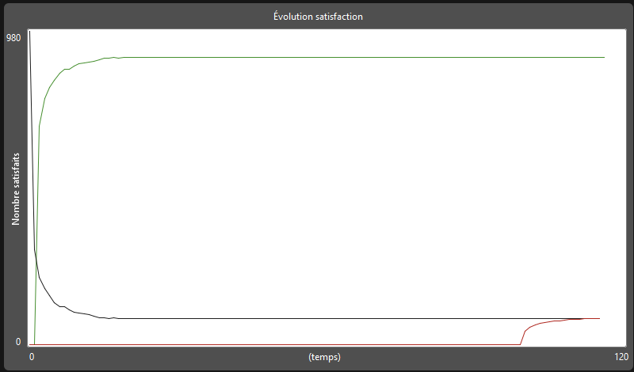

# Modèle de Ségrégation de Schelling — NetLogo

## Description

Ce modèle simule le **modèle de ségrégation de Thomas Schelling** (1971), qui démontre comment des préférences individuelles modérées peuvent mener à une ségrégation spatiale forte au niveau collectif.

Deux groupes d'agents (rouges et bleus) se déplacent sur une grille selon leur niveau de satisfaction vis-à-vis de leurs voisins. Un agent est satisfait si la proportion de voisins de sa propre couleur dépasse un seuil défini.

---

## Fichiers

```
schelling.nlogo       — Code source principal du modèle
README.md             — Ce fichier
```

---

## Paramètres (Sliders)

| Slider | Plage | Description |
|---|---|---|
| `densite` | 1 – 100 | Pourcentage de cases occupées par des agents |
| `proportion-rouge` | 0 – 100 | Pourcentage d'agents de couleur rouge |
| `seuil` | 0 – 100 | Satisfaction minimale requise (% de voisins similaires) |
| `deplacement-max` | 10 – 1000 | Nombre maximum de déplacements autorisés par agent |

---

## Monitors

| Monitor | Reporter | Description |
|---|---|---|
| **Agents satisfaits** | `agents-satisfaits` | Nombre d'agents dont le seuil est atteint |
| **Agents non satisfaits** | `agents-non-satisfaits` | Nombre d'agents insatisfaits |
| **Agents bloqués** | `agents-bloques` | Agents insatisfaits ayant atteint leur limite de déplacements |

---

## Fonctionnement

### Setup
- La grille est initialisée avec toutes les cases vides.
- Les agents sont placés aléatoirement selon la densité choisie.
- Chaque agent reçoit une couleur (rouge ou bleu) selon `proportion-rouge`.
- Le compteur `nb-deplacements` de chaque agent est initialisé à `0`.

### Boucle principale (Go)
À chaque tick :
1. Chaque agent **calcule sa satisfaction** en comptant la proportion de voisins de même couleur parmi ses 8 voisins.
2. Si un agent est insatisfait **et** n'a pas atteint `deplacement-max`, il se déplace vers une case vide.
3. Les monitors sont mis à jour.
4. La simulation s'arrête si :
   - Tous les agents sont satisfaits, **ou**
   - Tous les agents insatisfaits ont atteint leur limite de déplacements.

### Calcul de la satisfaction
```
satisfaction = (voisins de même couleur / total voisins) × 100
satisfait? = satisfaction >= seuil
```
Un agent sans voisin est considéré **insatisfait**.

### Déplacement
L'agent libère sa case actuelle et cherche une case vide. Il préfère les cases dont les 8 voisins ne sont pas tous occupés. Le compteur `nb-deplacements` est incrémenté à chaque déplacement réussi.

---

## Variables internes

### Globals
| Variable | Description |
|---|---|
| `nb-satisfaits` | Nombre total d'agents satisfaits au tick courant |

### Turtles-own
| Variable | Description |
|---|---|
| `satisfait?` | Booléen — l'agent est-il satisfait ? |
| `nb-deplacements` | Nombre de déplacements effectués par cet agent |

### Patches-own
| Variable | Description |
|---|---|
| `occupe?` | Booléen — la case est-elle occupée ? |

---

## Résultats typiques

### Cas 1 — Seuil Élevé 

- **Seuil de satisfaction :** 80 %
- **Limite maximale de déplacement :** 70
- **Méthode d'échantillonnage :** Homogène
- **Résultat :** Moins de 25 % de satisfaction des agents
- **Résultat :** La distribution spatiale est restée aléatoire malgré la limite de 70 déplacements — aucun regroupement ni convergence observés

### Cas 2 — Seuil Faible 

- **Seuil de satisfaction :** 15 %
- **Méthode d'échantillonnage :** Homogène
- **Résultat :** Taux de satisfaction de 100 % atteint en moins de 4 ticks de simulation
- **Résultat :** La distribution des couleurs est restée largement aléatoire ; aucune ségrégation spatiale significative n'a émergé en raison du faible seuil de tolérance

### Cas 3 — Seuil Optimal 

- **Seuil de satisfaction :** 40 %
- **Densité maximale (approx.) :** ~20
- **Résultat :** 100 % de satisfaction des agents atteint avec le nombre minimal de déplacements parmi toutes les configurations testées
- **Résultat :** Les résultats sont restés robustes même à densité maximale ; des regroupements spatiaux et des patterns de ségrégation clairs ont émergé

---

## Analyse Globale


Un seuil de satisfaction modéré de 40 % produit une ségrégation spatiale forte . Les agents n'excluent pas activement l'autre groupe ; ils cherchent simplement à éviter de se retrouver en minorité extrême dans leur voisinage immédiat. Même lorsque les agents font preuve d'une certaine tolérance à la diversité (acceptant un statut minoritaire jusqu'à 40–50 %), le système se stabilise presque invariablement dans un état de ségrégation prononcée, démontrant la robustesse de ce résultat émergent pour une large gamme de configurations de préférences individuelles.

---

## Référence

> Schelling, T.C. (1971). *Dynamic models of segregation*. Journal of Mathematical Sociology, 1(2), 143–186.

---

## Auteur

Modèle implémenté en NetLogo.
